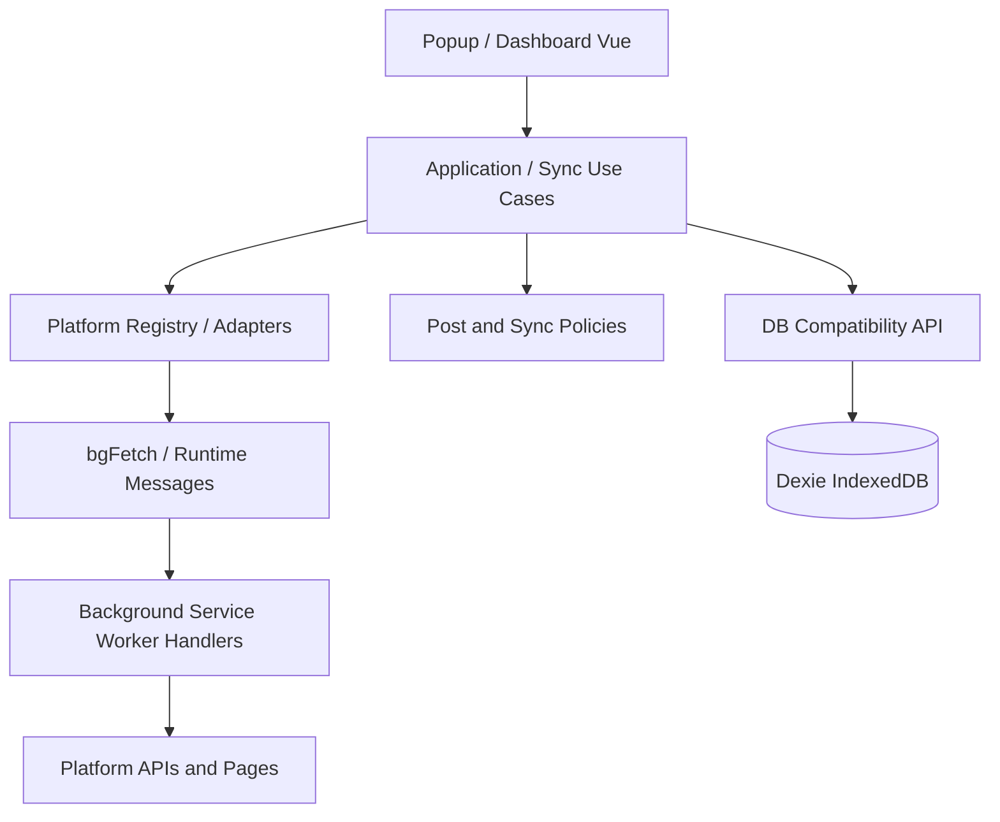

# Creator Feed Hub

一个基于 WXT、Vue 3 和 Manifest V3 的本地优先创作者动态聚合扩展。

它把多个平台的创作者账号归集到同一份关注列表中，在浏览器内保存动态、收藏、标签和同步状态，提供统一的动态流与账号管理界面。

## 特性

- 多平台账号归集：Bilibili、YouTube、X/Twitter、Pixiv、Fantia、Rplay、Withny、小红书、微博和 RSS。
- Popup 快速关注：从当前创作者页面识别链接、昵称和头像，创建创作者或绑定已有创作者。
- Dashboard 动态流：平台筛选、标签包含/排除、转发过滤、纯文字过滤、搜索、瀑布流、收藏和灯箱预览。
- 关注管理：按创作者查看绑定账号，支持账号角色、单账号同步、深度历史回溯、批量同步和批量删除。
- 本地优先：创作者、账号、动态和设置保存在浏览器 IndexedDB；扩展不依赖自建后端或遥测服务。
- 会话复用：按浏览器扩展权限使用对应平台的登录 Cookie；Rplay 会话可从打开的页面同步到 Chrome Extension Storage。
- 同步保护：超时、冷却、请求间隔、增量水位、历史游标和收藏保护。
- 自动同步：后台通过 `chrome.alarms` 每 30 分钟执行一次同步，并更新未读角标。
- 备份迁移：支持导出和导入 JSON 数据。
- 头像管理：添加创作者时尝试读取当前页面头像；创作者可从多个绑定账号头像中选择并持久化主头像。
- 交接记录：`HANDOFF_AVATAR.md` 仅记录头像功能目标、已确认事实和待确认问题。

## 快速开始

### 环境

- Node.js 18+
- npm
- Chrome、Edge 或其他 Chromium 浏览器

### 安装依赖

```bash
npm install
```

### 开发模式

```bash
npm run dev
```

WXT 会启动开发构建。根据终端输出加载对应的开发扩展目录。

### 生产构建

```bash
npm run build
```

产物位于：

```text
.output/chrome-mv3/
```

加载方式：

1. 打开 `chrome://extensions/` 或 `edge://extensions/`。
2. 开启“开发者模式”。
3. 点击“加载已解压的扩展程序”。
4. 选择 `.output/chrome-mv3/`。
5. 代码更新后重新执行构建，并在扩展管理页点击“重新加载”。

打包 ZIP：

```bash
npm run zip
```

## 使用流程

1. 在支持的平台打开创作者主页。
2. 点击浏览器工具栏中的 Creator Feed Hub 图标。
3. 在 Popup 中确认识别结果，选择“新建创作者”或绑定已有创作者。
4. 打开 Dashboard，在“动态”页同步全部账号或单独刷新账号。
5. 在“关注”页维护创作者、平台账号、角色和标签。
6. 在“收藏”页查看长期保留的动态。
7. 在“设置”页管理平台状态、同步参数、数据清理和 JSON 备份。

## 数据与隐私

项目采用本地优先设计：

- 业务数据存储在扩展自己的 IndexedDB 数据库中。
- 设置和部分会话凭证存储在 Chrome Extension Storage 中。
- 网络请求由扩展适配器发起，必要时通过 Background Service Worker 代理以避开页面 CORS。
- 源码仓库不包含用户的创作者数据、动态、Cookie、Token、数据库或备份文件。
- 本仓库不配置远程 Git 推送之外的应用后端；GitHub 只存放项目源码和配置。

扩展申请的敏感权限包括 `cookies`、`tabs`、`scripting`、`activeTab` 和平台 host permissions。它们用于读取登录状态、识别当前页面和执行平台适配器请求。安装扩展前应确认你信任该源码和权限范围。

## 项目架构

项目采用“入口薄、业务分层、平台隔离、兼容迁移”的结构。数据加载、回收站状态、主题状态已完成 Dashboard 组合层抽离；四个 Dashboard Tab 已由真实 `FeedView`、`CreatorsView`、`BookmarksView`、`SettingsView` 承载并接入 `App.vue`。App.vue 仍保留跨页面状态组合、全局弹窗及部分应用动作，后续继续收敛，详见 [`docs/DASHBOARD_MIGRATION.md`](docs/DASHBOARD_MIGRATION.md)。

重构只移动职责，不重写抓取算法、数据库协议或用户流程。



### 分层职责

| 层 | 目录 | 规则 |
|---|---|---|
| 扩展入口 | `entrypoints/` | 只注册 WXT、Chrome 事件和 UI 入口，不承载大段业务流程 |
| UI 组合层 | `entrypoints/*/composables/`、`components/`、`views/` | 管理界面状态和用户操作，不直接实现平台抓取算法 |
| 同步应用层 | `src/sync/` | 编排频道同步、批量同步、历史同步和进度，不解析平台原始响应 |
| 平台层 | `src/platform/`、`src/adapters/` | 注册并实现平台请求、解析和统一 `FetchResult` |
| 数据基础设施 | `src/infrastructure/db/`、`src/db/` | Dexie、仓储和数据生命周期；`src/db` 保留兼容导出 |
| Chrome 基础设施 | `src/infrastructure/chrome/` | Background 消息、Alarm、角标、DNR 和请求代理 |
| 通用工具 | `src/utils/` | 无业务状态的 URL、媒体和 HTTP 辅助函数 |

### 目录

```text
creator-feed-hub/
├─ entrypoints/
│  ├─ background.ts                    # MV3 入口和薄消息路由
│  ├─ rplay-sync.content.ts            # Rplay 页面会话同步
│  ├─ popup/
│  │  ├─ App.vue                       # Popup 页面组合
│  │  └─ composables/useRplaySync.ts  # Rplay UI 状态
│  └─ dashboard/
│     ├─ App.vue                       # 布局、导航、跨页面组合与全局弹窗
│     ├─ composables/                  # Dashboard 共享状态与数据组合
│     ├─ components/                   # 可复用展示组件
│     └─ views/                        # Feed/Creators/Bookmarks/Settings 页面
├─ src/
│  ├─ types/index.ts                   # Creator、Channel、Post、Settings
│  ├─ platform/                        # Adapter 注册兼容层
│  ├─ adapters/                        # 各平台实现和旧入口导出
│  ├─ sync/                            # 同步应用流程
│  ├─ db/                              # 旧数据库 API 兼容入口
│  ├─ infrastructure/
│  │  ├─ db/                           # Dexie、设置、统计、动态仓储
│  │  └─ chrome/                       # Background 基础设施和消息 handler
│  ├─ services/imageCache/             # 本地文件系统图片缓存
│  └─ utils/                           # HTTP、媒体、URL 解析
├─ assets/main.css
├─ public/icons/
├─ docs/
│  ├─ ARCHITECTURE.md                 # 当前架构、依赖边界和数据流
│  ├─ DEVELOPMENT.md                  # 增量开发、兼容迁移和验证规范
│  └─ DASHBOARD_MIGRATION.md          # Dashboard 分阶段迁移记录和验收标准
├─ package.json
├─ wxt.config.ts
└─ README.md
```

## 核心数据流

### 添加创作者

```text
当前网页
  → Popup tabs.query
  → scripting.executeScript 识别页面信息
  → urlParser.parseProfileUrl
  → 用户确认新建或绑定
  → DB 兼容 API
  → Dexie creators/channels
```

对 `chrome://`、`edge://`、`about:` 和 `devtools:` 页面，Popup 会跳过 DOM 注入，因为浏览器禁止扩展脚本访问这些内部页面。

### 同步动态

```text
Dashboard / 自动同步
  → src/sync/updateChannel
  → platform registry
  → PlatformAdapter.fetchLatest
  → bgFetch
  → runtime.sendMessage(BG_FETCH)
  → Background message handler
  → 统一 FetchResult
  → 增量过滤、去重、墓碑策略
  → DB post repository
  → Dashboard reloadData
```

### Background 消息

Background 入口只保留路由和生命周期注册。消息实现位于：

```text
src/infrastructure/chrome/messages/
├─ bgFetch.ts
├─ proxyImage.ts
├─ rplaySync.ts
└─ twitterTimeline.ts
```

当前消息契约必须保持兼容：

```text
UPDATE_AUTO_SYNC
OPEN_DASHBOARD
SAVE_RPLAY_TOKEN
BG_FETCH
PROXY_IMAGE
SYNC_RPLAY_TOKEN
FETCH_TWITTER_TIMELINE
```

改变消息名称、入参、响应字段或异步 `sendResponse` 行为时，必须同时迁移所有调用方并做扩展运行时验证。

## 新功能开发手册

### 1. 先写功能边界

每个增量功能开始前，先明确：

```text
问题：用户现在遇到什么具体问题？
目标：完成后用户能观察到什么结果？
非目标：本次明确不做什么？
影响：UI、同步、平台、数据库、权限、导入导出分别是否受影响？
兼容：旧数据库、旧 JSON、旧消息和旧平台是否继续可用？
回滚：出现问题时是否能关闭或恢复旧路径？
验收：哪些可操作步骤证明功能完成？
```

### 2. 按数据流实现

推荐顺序：

```text
类型/契约
  → 领域规则
  → 应用用例
  → Repository 或 Platform Adapter
  → Composable
  → Vue 组件
  → 入口接线
```

不要把数据库写入、平台请求或同步编排直接追加到 `App.vue` 和 `background.ts`。

### 3. 新增平台

新增平台需要：

1. 在 `src/adapters/` 新增平台实现。
2. 实现 `PlatformAdapter.fetchLatest()`。
3. 如果需要历史同步，使用已声明的可选 `fetchHistory()` 能力。
4. 如果需要平台 fallback，使用已声明的 `fetchAjaxFallback()` 能力。
5. 如果需要 Twitter 类解析器，使用已声明的 `parseGraphQLResult()` 能力。
6. 在 `src/platform/registry.ts` 注册。
7. 在 `src/types/index.ts` 增加平台元数据。
8. 在 `wxt.config.ts` 增加最小必要的 host permission。
9. 更新 URL 解析和 Popup 页面识别规则。
10. 验证新平台不会改变其他平台的同步、收藏和去重行为。

平台 Adapter 只负责请求和归一化数据，不直接操作 Dexie，不修改 Vue 状态。

### 4. 修改数据库

必须遵守：

- 不修改数据库名称 `CreatorFeedHubDB`。
- 不删除或重排已有 Dexie version 1–3。
- 新 schema 只追加新版本。
- 新字段必须有旧数据默认值。
- 导入旧 JSON 时必须允许缺少新字段。
- 动态 ID 生成规则不能随意改变，否则会影响收藏、已读和墓碑记录。

### 5. 修改 Runtime Message

先搜索所有发送方和接收方，再修改协议。必须同步更新：

```text
message type
入参校验
sendResponse 返回结构
异步 return true
调用方的错误处理
```

消息 handler 不应直接承担 Vue 状态或数据库业务；复杂业务应调用应用层服务。

### 6. 性能规则

- 优先使用已有 IndexedDB 索引，不为一次性展示增加全量扫描。
- 不在 UI 组件中重复查询同一数据。
- 批量写入使用 Dexie `bulkPut` / `bulkDelete`。
- 不复制大数组或完整媒体 payload，除非业务确实需要快照。
- 平台请求继续遵守现有 cooldown、请求间隔和增量水位。
- 不为了“现代化”引入新的状态管理或请求库。

## 兼容式重构规则

重构允许移动职责，不允许无计划改变行为：

1. 先保留旧导出路径。
2. 新模块只保留一份真实实现。
3. 旧模块通过 re-export 或薄委托兼容旧调用方。
4. 不在迁移期复制两套同步或数据库逻辑。
5. 每移动一个边界，立即运行构建。
6. 先拆低风险纯职责，再拆消息和平台强耦合逻辑。
7. 不把 `any` 作为新边界类型；外部数据使用 `unknown` 后做类型收窄。
8. 不在没有迁移策略时改变 `Post`、`Channel`、消息和数据库契约。

## 构建、验证与排错

常用命令：

```bash
npm install
npm run dev
npm run build
npm run zip
npx tsc --noEmit
```

`npm run build` 是当前必须通过的扩展构建检查。`npx tsc --noEmit` 用于发现类型问题；如果 WXT/Chrome ambient 类型导致诊断，应区分环境问题和本次改动问题，不得直接忽略新增文件的诊断。

最小手动回归清单：

- Popup 打开并识别一个平台主页。
- 新建创作者并绑定平台账号。
- Dashboard 加载已有动态。
- 单频道同步和全部同步。
- 历史同步和增量同步。
- 收藏、已读、删除和恢复动态。
- 导出并重新导入 JSON。
- Rplay Token 同步。
- 图片代理和本地图片缓存设置。
- 自动同步设置和未读角标。

如果扩展页面没有更新：

```bash
npm run build
```

然后在 `chrome://extensions/` 点击“重新加载”。普通跨域请求必须继续通过 Background Service Worker 代理。

## 提交检查清单

提交前必须确认：

```text
[ ] 没有改变数据库名称、已有 schema 版本或动态 ID
[ ] 没有改变 Runtime Message 名称和返回结构
[ ] 新平台没有直接写数据库或修改 Vue 状态
[ ] 旧 import 路径仍然有效，或已完成所有调用方迁移
[ ] 没有新增重复实现和无意义兼容别名
[ ] npm run build 通过
[ ] 相关核心流程已手动回归
[ ] git diff --check 通过
[ ] git status --short --ignored 未包含数据库、凭证和构建产物
```

```bash
git diff --check
git status --short --ignored
```

提交应聚焦单一功能或单一结构边界：

```bash
git add .
git commit -m "描述变更"
git push
```

## License

当前项目未声明开源许可证。未经项目所有者授权，不应将其作为已授权开源项目分发。
