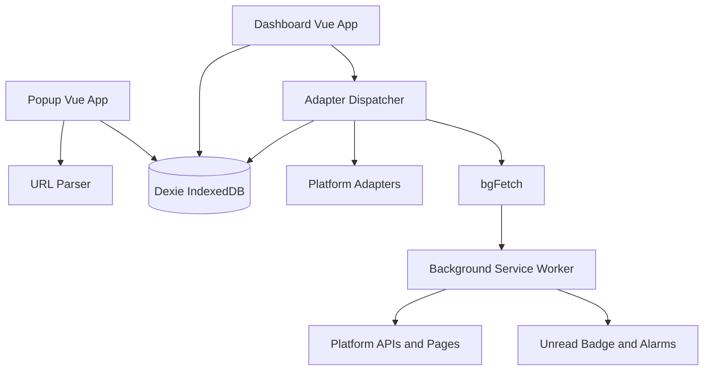

# Creator Feed Hub

一个基于 WXT、Vue 3 和 Manifest V3 的本地优先创作者动态聚合扩展。

它把多个平台的创作者账号归集到同一份关注列表中，在浏览器内保存动态、收藏、标签和同步状态，提供统一的动态流与账号管理界面。

## 特性

- 多平台账号归集：Bilibili、YouTube、X/Twitter、Pixiv、Fantia、Rplay、Withny、小红书、微博和 RSS。
- Popup 快速关注：从当前创作者页面识别链接、昵称和头像，创建创作者或绑定已有创作者。
- Dashboard 动态流：平台筛选、标签包含/排除、转发过滤、纯文字过滤、搜索、瀑布流、收藏和灯箱预览。
- 关注管理：按创作者查看绑定账号，支持账号角色、单账号同步、深度历史回溯、批量同步和批量删除。
- 本地优先：创作者、账号、动态和设置保存在浏览器 IndexedDB；扩展不依赖自建后端或遥测服务。
- 会话复用：按浏览器扩展权限使用对应平台的登录 Cookie；Rplay 会话可从打开的页面同步到 Chrome Extension Storage。
- 同步保护：超时、冷却、请求间隔、增量水位、历史游标和收藏保护。
- 自动同步：后台通过 `chrome.alarms` 每 30 分钟执行一次同步，并更新未读角标。
- 备份迁移：支持导出和导入 JSON 数据。
- 头像管理：添加创作者时尝试读取当前页面头像；创作者可从多个绑定账号头像中选择并持久化主头像。
- 交接记录：`HANDOFF_AVATAR.md` 仅记录头像功能目标、已确认事实和待确认问题。

## 快速开始

### 环境

- Node.js 18+
- npm
- Chrome、Edge 或其他 Chromium 浏览器

### 安装依赖

```bash
npm install
```

### 开发模式

```bash
npm run dev
```

WXT 会启动开发构建。根据终端输出加载对应的开发扩展目录。

### 生产构建

```bash
npm run build
```

产物位于：

```text
.output/chrome-mv3/
```

加载方式：

1. 打开 `chrome://extensions/` 或 `edge://extensions/`。
2. 开启“开发者模式”。
3. 点击“加载已解压的扩展程序”。
4. 选择 `.output/chrome-mv3/`。
5. 代码更新后重新执行构建，并在扩展管理页点击“重新加载”。

打包 ZIP：

```bash
npm run zip
```

## 使用流程

1. 在支持的平台打开创作者主页。
2. 点击浏览器工具栏中的 Creator Feed Hub 图标。
3. 在 Popup 中确认识别结果，选择“新建创作者”或绑定已有创作者。
4. 打开 Dashboard，在“动态”页同步全部账号或单独刷新账号。
5. 在“关注”页维护创作者、平台账号、角色和标签。
6. 在“收藏”页查看长期保留的动态。
7. 在“设置”页管理平台状态、同步参数、数据清理和 JSON 备份。

## 数据与隐私

项目采用本地优先设计：

- 业务数据存储在扩展自己的 IndexedDB 数据库中。
- 设置和部分会话凭证存储在 Chrome Extension Storage 中。
- 网络请求由扩展适配器发起，必要时通过 Background Service Worker 代理以避开页面 CORS。
- 源码仓库不包含用户的创作者数据、动态、Cookie、Token、数据库或备份文件。
- 本仓库不配置远程 Git 推送之外的应用后端；GitHub 只存放项目源码和配置。

扩展申请的敏感权限包括 `cookies`、`tabs`、`scripting`、`activeTab` 和平台 host permissions。它们用于读取登录状态、识别当前页面和执行平台适配器请求。安装扩展前应确认你信任该源码和权限范围。

## 项目架构



### 目录

```text
creator-feed-hub/
├─ assets/
│  └─ main.css                         # Tailwind CSS 入口和全局样式
├─ entrypoints/
│  ├─ background.ts                    # MV3 Service Worker、BG_FETCH、定时同步、徽标
│  ├─ rplay-sync.content.ts            # Rplay 页面会话同步 content script
│  ├─ popup/
│  │  ├─ App.vue                       # 快速识别、创建和绑定账号；页面信息提取
│  │  ├─ index.html
│  │  └─ main.ts
│  └─ dashboard/
│     ├─ App.vue                       # Dashboard 状态编排、关注管理和主头像选择
│     ├─ components/
│     │  ├─ PostCard.vue                # Feed/收藏共用动态卡片
│     │  ├─ MediaLightbox.vue           # 媒体灯箱
│     │  └─ DashboardSection.vue        # Dashboard 视图边界容器
│     ├─ views/
│     │  └─ FeedView.vue                # 预留的动态视图组件边界
│     ├─ index.html
│     └─ main.ts
├─ src/
│  ├─ types/index.ts                   # Platform、Creator、Channel、Post、Settings
│  ├─ db/index.ts                       # Dexie 数据库、设置、统计、清理
│  ├─ utils/
│  │  ├─ http.ts                        # Background fetch 通信和请求封装
│  │  └─ urlParser.ts                   # 平台主页、内容页和 RSS URL 解析
│  └─ adapters/
│     ├─ index.ts                       # 适配器注册、同步调度、超时和增量逻辑
│     ├─ types.ts                       # PlatformAdapter、FetchResult、FetchOptions
│     ├─ bilibili.ts
│     ├─ twitter.ts
│     ├─ youtube.ts
│     ├─ pixiv.ts
│     ├─ fantia.ts
│     ├─ rplay.ts
│     ├─ withny.ts
│     ├─ xiaohongshu.ts
│     ├─ weibo.ts
│     └─ rss.ts
├─ public/icons/                        # 扩展图标
├─ package.json
├─ tsconfig.json
├─ wxt.config.ts                        # WXT、Manifest 和权限配置
└─ .gitignore                            # 构建产物、数据库、凭证和备份忽略规则
```

## 核心数据流

### 添加创作者

```text
当前网页
  → Popup tabs.query
  → scripting.executeScript 识别页面信息
  → urlParser.parseProfileUrl
  → 用户确认新建或绑定
  → Dexie creators/channels
```

对 `chrome://`、`edge://`、`about:` 和 `devtools:` 页面，Popup 会跳过 DOM 注入，因为浏览器禁止扩展脚本访问这些内部页面。

### 同步动态

```text
Dashboard / 自动同步
  → adapters.updateChannel
  → 平台 adapter.fetchLatest
  → bgFetch
  → runtime.sendMessage(BG_FETCH)
  → Background Service Worker fetch
  → adapter 解析 FetchResult
  → 增量过滤和去重
  → Dexie posts.bulkPut
  → Dashboard reloadData
```

适配器通过统一接口接入：

```ts
interface PlatformAdapter {
  platform: string;
  fetchLatest(channel: Channel, limit?: number, options?: FetchOptions): Promise<FetchResult>;
  checkAuthStatus?(): Promise<{ loggedIn: boolean; username?: string }>;
}
```

新增平台通常需要：

1. 在 `src/adapters/` 新增适配器。
2. 实现 `PlatformAdapter`。
3. 在 `src/adapters/index.ts` 注册。
4. 在 `src/types/index.ts` 添加平台元数据。
5. 在 `wxt.config.ts` 增加必要的 host permission。
6. 更新 URL 解析规则和 UI 平台状态逻辑。

## 构建与排错

如果扩展页面没有更新：

```bash
npm run build
```

然后到 `chrome://extensions/` 点击“重新加载”。

如果看到旧的扩展错误记录，先在错误详情页点击“全部清除”，再重新操作。Chrome 内部页面上的脚本注入会被浏览器禁止；普通网站请求应统一通过 Background Service Worker 代理。

## Git 开发约定

本地构建目录、依赖目录、本地数据库、备份和凭证已加入 `.gitignore`。提交前检查：

```bash
git status --short --ignored
git diff --check
```

提交后推送：

```bash
git add .
git commit -m "描述变更"
git push
```

## License

当前项目未声明开源许可证。未经项目所有者授权，不应将其作为已授权开源项目分发。
